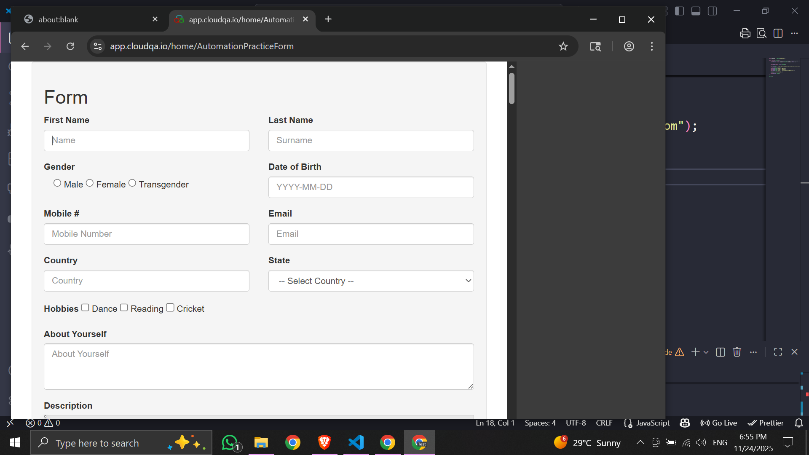
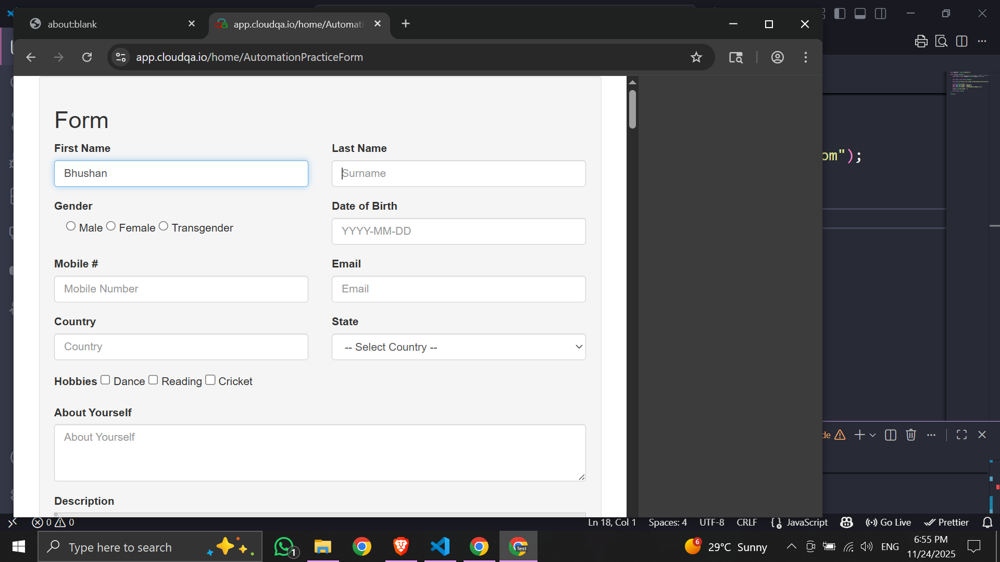
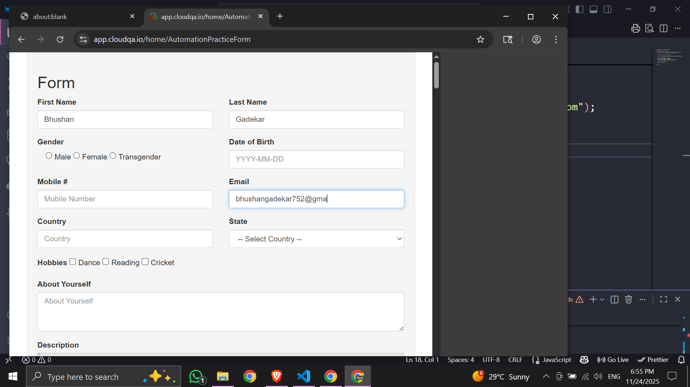

# CloudQA Automation Task - MERN Stack (Puppeteer)

This repository contains an automation script created using **Node.js + Puppeteer**.  
It automatically launches a Chrome browser, opens the CloudQA Automation Practice Form, and fills three fields.

This task was completed as per CloudQA internship assignment instructions.

---

##  Tech Stack Used

- Node.js
- Puppeteer
- JavaScript (ES6)

---

##  Project Structure
cloudqa-test/
│
├── index.js
├── package.json
├── package-lock.json
└── README.md


---

##  What this automation does

The script:

 Opens Chrome  
 Loads Automation form page  
 Enters values in:  
   - First Name  
   - Last Name  
   - Email  
 Prints: **TEST PASSED!**  
 Closes Browser


##  Source Code (index.js)

```bash

const puppeteer = require("puppeteer");

async function runTest() {
    // puppeteer.launch() Chrome browser open hoga   headless = hidden browser -> false → show browser
    const browser = await puppeteer.launch({ headless: false });

    const page = await browser.newPage();

    await page.goto("https://app.cloudqa.io/home/AutomationPracticeForm");

    // fill fields automatic 
    await page.type('#fname', "Bhushan");
    await page.type('#lname', "Gadekar");
    await page.type('#email', "bhushangadekar752@gmail.com");

    console.log("TEST PASSED...");

    await browser.close();
}

runTest();

```

## Run 
```bash
  node index.js
```

##  Screenshots

All screenshots related to the automation run are stored here:






